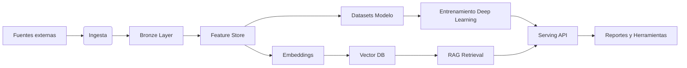

# Arquitectura Caria

## Visión General
Caria está diseñada como una plataforma modular que orquesta el flujo de datos desde la ingesta hasta la generación de reportes asistidos por RAG. Cada capa se implementa en `src/caria/` con pipelines declarativos en `configs/pipelines/`.

## Capas Principales

- **Ingestión (`src/caria/ingestion/`)**: conectores para FMP, FRED, NewsAPI, Reddit y Twitter. Se ejecutan vía Prefect y persisten datos crudos en `data/raw/`.
- **Feature Store (`src/caria/feature_store/`)**: transforma datos a capas Silver/Gold con validaciones (Great Expectations) y publica features en Feast.
- **Embeddings (`src/caria/embeddings/`)**: genera representaciones semánticas para la sabiduría histórica y noticias, y sincroniza con `pgvector`.
- **Modelos (`src/caria/models/`)**: implementa encoders multi-modales y pipelines de entrenamiento con PyTorch Lightning + Hydra.
- **Retrieval (`src/caria/retrieval/`)**: abstrae accesos al vector store y expone retrievers reutilizables por el MCP server.
- **Servicios (`services/`)**: API FastAPI, servidor MCP y workers de mantenimiento.

## Orquestación
- **Prefect Flows**: definidos en `src/caria/pipelines/*_pipeline.py` y ejecutados por scripts en `scripts/orchestration/`.
- **Observabilidad**: logs estructurados, métricas (Prometheus futuro) y experiment tracking en MLflow.

## Datos y Versionado
- Data lake local (raw/bronze/silver/gold) con particiones por fecha.
- Vector store versionado mediante `index_version` y migraciones gestionadas con Alembic.
- Feature store versionado por entidades y TTL.

## Seguridad y Configuración
- Variables privadas en `.env`; cargadas con `python-dotenv`.
- Configuración jerárquica con Hydra (`configs/`).

